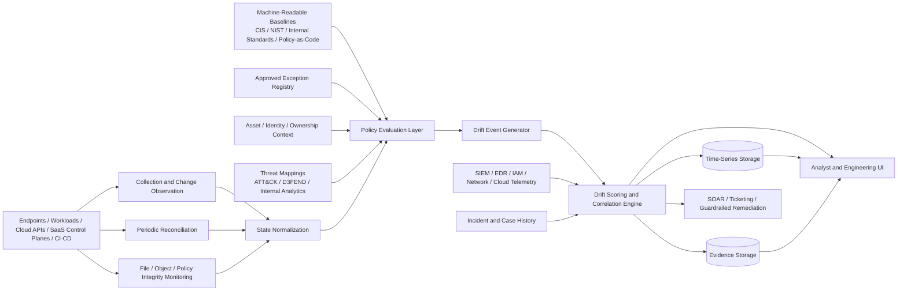

# Beyond Checklists: Turning Compliance Drift into Real-Time Security Signals

**Author:** Mher Saratikyan Creator of [**Cactus**](https://justcactus.net)  
**Date:** April 1, 2026

> **Core thesis.** Most organizations do not fail because they never defined controls. They fail because the live environment drifts away from the secure state those controls were supposed to maintain. This paper argues that compliance drift should be modeled as a continuous security signal, not a periodic audit artifact.

---

## Abstract

Enterprise security programs often assume that control failure means a control was never selected, never implemented, or never reviewed. In practice, many failures emerge later. A system is hardened, documented, and maybe even audited successfully, then gradually diverges from its intended secure state under operational pressure. The deviation is real, persistent, and often security-relevant, but it is not treated as part of the detection plane.

This paper argues that **compliance drift** should be treated as a first-class security signal. The central claim is that deviation between intended secure state and actual runtime state contains operationally useful information about exposure, control degradation, and attack surface expansion. When that deviation is continuously measured, normalized, enriched with asset and threat context, and correlated with runtime telemetry, it becomes useful for detection engineering, prioritization, and response.

The paper makes seven contributions. First, it defines compliance drift as a time-dependent divergence problem rather than a static compliance deficiency. Second, it explains why point-in-time compliance models underperform in dynamic environments. Third, it proposes a drift taxonomy that separates critical, silent, noisy, visibility-reducing, identity, and provenance drift. Fourth, it introduces a practical architecture that combines agents, reconciliation, integrity monitoring, policy engines, exception registries, scoring, and analyst workflows. Fifth, it proposes measurable concepts such as drift rate, drift density, drift half-life, time-to-drift-detection, exception debt, and drift-to-incident correlation. Sixth, it extends the model to cloud, Kubernetes, identity, and software supply chain state. Seventh, it outlines how AI can assist interpretation and prioritization without becoming the source of truth for control evaluation.

The goal is not to replace existing frameworks such as NIST, CIS, STIGs, or machine-readable control ecosystems. The goal is to operationalize them so that hardening regressions, baseline violations, and exception sprawl become real-time inputs to security decisions rather than delayed audit observations.[^nist137][^nist128][^oscal2024][^cisbench]

---

Some constructs in this paper are **proposed concepts** rather than borrowed industry terms, including **drift budget**, **baseline entropy**, **drift half-life**, and **drift activation**. They are introduced here because existing compliance language is too weak for operational security work.

---

## Table of Contents

1. [Introduction](#1-introduction)  
2. [Background](#2-background)  
3. [Problem Definition](#3-problem-definition)  
4. [Why Current Approaches Fail](#4-why-current-approaches-fail)  
5. [Compliance Drift as a Security Signal](#5-compliance-drift-as-a-security-signal)  
6. [Taxonomy of Drift](#6-taxonomy-of-drift)  
7. [Proposed Architecture](#7-proposed-architecture)  
8. [Metrics and Measurement](#8-metrics-and-measurement)  
9. [Practical Scenarios](#9-practical-scenarios)  
10. [Integration with AI and Modern Systems](#10-integration-with-ai-and-modern-systems)  
11. [Implementation Guidance](#11-implementation-guidance)  
12. [Discussion](#12-discussion)  
13. [Future Work](#13-future-work)  
14. [Conclusion](#14-conclusion)  
15. [References](#references)  

---

## 1. Introduction

Security teams are surrounded by checklists. Hardening guides define expected states. Compliance frameworks define required controls. Internal standards document how systems should be configured. Audit processes periodically validate that these expectations were satisfied. Yet breaches and near-misses continue to emerge from environments that were, at some point, described as compliant.

The gap is not just tooling. It is a modeling problem.

Most compliance programs are built to answer static governance questions:

- Was a control defined?
- Was it deployed?
- Was it reviewed?
- Was evidence collected?

Attackers exploit a different question:

- **What is true right now on the running system?**

That difference matters. A server may have been hardened last quarter, but now permits a risky execution path. A firewall may have been reviewed last month, but a temporary rule remains open in production. A cloud tenant may still map cleanly to the organization’s control spreadsheet, while a named location, role assignment, or logging policy has drifted enough to change exposure materially. These conditions often become dangerous long before they become audit findings.[^msmisconfig]

This problem has become more severe for four reasons.

First, infrastructure changes faster than review cycles. Cloud resources, containers, SaaS control planes, endpoint agents, CI/CD pipelines, and delegated administration increase state change frequency dramatically.[^nist137][^awsconfig] Second, exception volume grows faster than exception retirement. Temporary deviations become semi-permanent because restoring the baseline often loses to service continuity. Third, security programs still separate prevention, detection, compliance, and platform engineering into different systems and teams. Fourth, control state increasingly extends beyond servers and appliances into identity providers, managed platforms, orchestration systems, and build pipelines.

The practical consequence is predictable: organizations may know whether they broadly align to a framework, but they do not know in operational time when their secure state is degrading in a way that should influence triage, detection sensitivity, or incident response.

This paper addresses that gap by reframing compliance as a continuous source of security telemetry. The thesis is not that every deviation is critical. The thesis is that deviations carry signal value when measured in context: what changed, where, for how long, under what exception model, on which asset or control plane, and in correlation with what other events.

---

## 2. Background

### 2.1 Traditional compliance models

Traditional compliance models provide normative guidance. NIST publications, CIS Benchmarks, STIGs, ISO control families, and related baselines define what secure operation should look like at policy and configuration level.[^nist128][^cisbench] Their value is significant. They reduce ambiguity, improve consistency, and give organizations portable control language.

The limitation is not the frameworks themselves. The limitation is how they are commonly operationalized.

Most real-world implementations are still evidence-oriented rather than state-oriented. Compliance is assessed using snapshots: exported scanner results, attestation forms, audit tickets, spreadsheet control matrices, or periodic benchmark reports. Even when automation exists, the outputs are frequently consumed as reports rather than as a live stream of state transitions.[^nist137][^oscal2024]

### 2.2 Security-focused configuration management

NIST SP 800-128 explicitly treats information security as an integral part of configuration management and frames security-focused configuration management as part of an organization’s overall risk discipline.[^nist128] This is important because it implicitly rejects the false split between “operations” and “security state.” A configuration is not secure merely because it was once approved. It remains secure only while its live state stays within the approved envelope.

In that sense, secure configuration is not a document. It is a maintained condition.

### 2.3 Continuous monitoring

NIST SP 800-137 defines information security continuous monitoring as providing visibility into assets, threats, vulnerabilities, and the effectiveness of deployed security controls, with the goal of supporting timely risk decisions.[^nist137] That is already close to the model argued here. The problem is that many organizations operationalize “continuous monitoring” mainly as alerting, vulnerability scanning, or log centralization. They do not consistently represent baseline drift itself as a security signal.

### 2.4 Machine-readable controls and compliance-as-code

The direction of travel is clear. OSCAL exists to modernize and automate control-based risk assessments using machine-readable representations.[^oscal][^oscalmap] SCAP standardizes the expression and exchange of security configuration and vulnerability information.[^scap] NIST’s recent OSCAL-related work explicitly discusses “compliance as code” and real-time visibility into control states.[^oscal2024]

These developments matter because they lower the cost of turning control intent into something evaluable by software. They do not, by themselves, solve the operational problem. A machine-readable control catalog is still not a sensing layer until it is joined to runtime state, asset identity, exception lifecycle, and security telemetry.

### 2.5 Detection and hardening are still too separate

MITRE ATT&CK models adversary tactics and techniques based on real-world observations, while MITRE D3FEND provides a vocabulary of defensive techniques such as application configuration hardening, credential hardening, and configuration inventory.[^attack][^d3fend] In practice, however, organizations often keep hardening and detection in different systems.

That separation creates a blind spot. When a control degrades, detection logic often does not become context-aware. When a detection fires, analysts often cannot quickly answer whether the affected system was already drifting from its secure state. That is operationally expensive.

---

## 3. Problem Definition

### 3.1 Formal definition of compliance drift

**Compliance drift** is the **time-dependent divergence** between an intended secure state and the actual runtime state of an asset, identity, workload, application, control plane component, or software supply chain process.

This definition has five important properties:

1. **Baseline-relative**  
   Drift only exists relative to an intended state. No baseline, no measurable drift.

2. **Time-dependent**  
   A deviation that lasted 30 seconds and was auto-corrected is not equivalent to one that persisted for 30 days.

3. **State-based**  
   The object of analysis is the live system, not merely its documented policy.

4. **Contextual**  
   The same deviation means different things on a developer workstation, a domain controller, a CI runner, a public Kubernetes namespace, or an identity control plane.

5. **Operationally consequential**  
   A deviation becomes a security signal when it affects exposure, visibility, or attack feasibility.

### 3.2 Intended secure state versus actual runtime state

The **intended secure state** is the authoritative definition of how a system should behave. It may be expressed through:

- benchmark items
- internal hardening standards
- deployment templates
- policy-as-code
- control inheritance models
- exception records
- role-specific configuration sets
- supply chain provenance requirements
- admission or authorization rules

The **actual runtime state** is what the environment is doing now. Depending on platform, it may include:

- configuration values
- effective privileges
- network reachability
- container security context
- file hashes and permissions
- startup persistence paths
- registry keys or kernel parameters
- identity assignments and conditional access objects
- enabled or disabled logging paths
- build provenance and artifact attestations
- policy enforcement mode
- resource relationships and dependency graph state

Drift exists when actual runtime state departs from intended secure state in a way that is semantically meaningful.

### 3.3 A more precise model

The basic comparison can be expressed as:

```text
Drift(t) = Delta( IntendedSecureState(t), ActualRuntimeState(t) )
```

But operational programs need a richer function:

```text
OperationalDrift(t) =
  Delta(State_expected, State_actual)
  x AssetCriticality
  x Persistence
  x ThreatRelevance
  x VisibilityImpact
  x ExceptionStatus
  x Recurrence
```

This is the key move in the paper. Drift is not just a mismatch. It is a mismatch interpreted under risk context.

### 3.4 Sources of drift

#### Configuration change

Normal change creates drift when state is modified but not reconciled to policy, or when “temporary” changes outlive their intent.

#### Exception sprawl

Exceptions are necessary. Unbounded exceptions are dangerous. Without scope, owner, approval, and expiry, an exception becomes a silent rewrite of the baseline.

#### Human factors

Administrators optimize for service continuity. Engineers optimize for velocity. Auditors optimize for evidence completeness. These are rational local incentives that collectively produce insecure global state.

#### System evolution

Baselines age. New services appear. Old agents remain. Workloads move from VMs to containers to serverless to SaaS. The baseline can drift from reality even before the environment drifts from the baseline.

#### Visibility failure

A system can drift by losing its own observability. Logging disabled, agents failing open, audit coverage gaps, broken forwarding, or exempted namespaces all produce a condition where not only security state degrades, but the ability to detect that degradation degrades too.

### 3.5 Why audits fail to capture drift

Audits are necessary. They are also structurally insufficient for this problem.

They usually fail to capture drift because they are:

- periodic while drift is continuous
- evidence-centric rather than state-transition-centric
- stronger at proving control presence than control persistence
- weak at correlating control degradation with threat activity
- not designed to encode recurrence, duration, or restoration failures

An environment can therefore be “compliant” in the reporting sense while operating in an insecure state in the operational sense.

---

## 4. Why Current Approaches Fail

### 4.1 Point-in-time compliance is blind to control decay

A monthly benchmark scan can prove that a setting was correct on day 30. It cannot show that the same control failed from day 2 through day 27 while suspicious authentication or execution events were occurring.

Security posture is not a single state. It is a time series.

### 4.2 Fragmented tools produce uncorrelated fragments

Organizations commonly use separate tools for:

- configuration assessment
- file integrity monitoring
- vulnerability management
- cloud posture management
- endpoint detection
- identity governance
- CI/CD policy checks
- ticketing and exception tracking

The same underlying problem may therefore appear as multiple unrelated facts. Analysts see a failing benchmark item. Platform teams see a change ticket. Detection engineers see a burst of suspicious activity. Nobody sees the full state transition.

### 4.3 Continuous validation is often too shallow

Many “continuous” programs are actually scheduled programs with shorter intervals. That is better than quarterly review and still weaker than event-aware evaluation. Effective validation combines event-triggered detection with reconciliation snapshots, not one or the other.[^awsconfig][^cfn-drift]

### 4.4 Compliance findings are rarely threat-aware

A control failure is more useful when expressed in adversarial terms:

- Which ATT&CK tactic or technique becomes easier now?
- Does the change expand attack surface or reduce visibility?
- Does this drift shorten a known attack path?
- Has this class of drift historically preceded incidents on this asset type?

Without threat semantics, compliance output becomes backlog instead of signal.[^attack][^attackdetect]

### 4.5 Exception handling is often immature

Most programs treat exceptions as paperwork. Operationally, they need to be treated as security state. An expired exception is not an administrative nuisance. It is a drift event. A broad exception on a privileged system is not “documentation debt.” It is exposure.

### 4.6 Many programs ignore non-host state

Modern attack surface is not only endpoint configuration. It includes:

- cloud control planes
- IAM and conditional access policies
- Kubernetes admission and namespace policy
- SaaS tenant settings
- build provenance and release integrity

If drift detection ends at the host, it misses much of the actual control plane.

---

## 5. Compliance Drift as a Security Signal

### 5.1 Signal criteria

A condition should be treated as a **security signal** when it satisfies all three of the following:

1. it is derived from authoritative expected state versus observed state
2. it changes the probability or impact of compromise, or the ability to detect compromise
3. it should influence a real operational decision

This separates signal from mere inventory mismatch.

### 5.2 Drift is often an early signal

Drift frequently appears **before** exploitation and **before** classic detection artifacts. That makes it a useful leading indicator. A newly exposed service, a logging gap, a policy exemption, or a weakened persistence control does not prove compromise. It changes the risk meaning of everything around it.

This is the important ordering relationship:

```text
Intended secure state
    -> drift begins
    -> exposure or visibility changes
    -> adversary opportunity increases
    -> suspicious events appear
    -> incident becomes observable
```

In other words, drift is usually **lagging relative to ideal state**, but often **leading relative to incidents**.

### 5.3 Drift activation

A useful concept is **drift activation**.

- **Latent drift** exists, but no relevant adversary behavior has yet been observed.
- **Activated drift** exists and nearby telemetry now indicates exploitation, probing, policy abuse, or suspicious execution that makes the drift operationally urgent.

This distinction improves prioritization. It prevents overreacting to every deviation while still recognizing that some deviations become urgent the moment they intersect with adversary-relevant activity.

### 5.4 Drift affects three dimensions

Every meaningful drift event should be classified by its impact on one or more of:

| Dimension | Question |
|---|---|
| **Exposure** | Did the drift make compromise more feasible? |
| **Visibility** | Did the drift reduce our ability to observe abuse? |
| **Control confidence** | Did the drift reduce confidence that a control still operates as intended? |

This triad makes compliance output more useful to detection and response teams.

---

## 6. Taxonomy of Drift

The original critical / silent / noisy classification is useful but incomplete. A stronger operational taxonomy is below.

### 6.1 Critical drift

Drift that materially increases compromise likelihood or impact.

Examples:
- disabled EDR or script logging on privileged systems
- unexpected public exposure of a management service
- weakened authentication requirements
- namespace policy relaxation in production Kubernetes
- deleted build provenance or unsigned release path on sensitive software

### 6.2 Silent drift

Low-visibility degradation that often goes unnoticed until another event occurs.

Examples:
- broken log forwarding
- expired exceptions left active
- disabled audit policy
- unmonitored startup path
- detection pipeline blind spots

### 6.3 Noisy drift

Technically real drift with weak security value or expected short duration.

Examples:
- controlled deployment-time variance
- workload-specific benchmark mismatches already exception-scoped
- known ephemeral states during autoscaling or image replacement

### 6.4 Visibility drift

Drift that reduces telemetry quality, coverage, or trustworthiness.

Examples:
- disabled endpoint telemetry
- misconfigured audit modes
- exempted namespaces in Kubernetes admission
- agent not reporting
- broken cloud configuration recorder
- tampered artifact attestation path

Visibility drift deserves special treatment because it weakens not only prevention but the sensing layer itself.[^aws-config-recorder][^si7]

### 6.5 Identity drift

Drift in access conditions, role assignments, trust boundaries, federation settings, or policy scope.

Examples:
- privileged role granted outside workflow
- named location deleted or changed in a way that weakens Conditional Access
- external identities unintentionally allowed into sensitive scopes
- stale service principal permissions
- MFA policy exclusions growing without review[^msmisconfig][^ca-network]

### 6.6 Provenance drift

Drift in software supply chain assurances.

Examples:
- build no longer emits attestations
- provenance no longer verifiable
- release performed outside approved build path
- signing key or build environment changed without approval
- SLSA level assumptions no longer satisfied[^gh-attest][^slsa]

### 6.7 Baseline drift

The baseline itself becomes stale relative to the environment.

Examples:
- server-era controls applied to ephemeral containers without adaptation
- SaaS tenant features introduced without control coverage
- identity provider objects added faster than the policy model evolves

This type matters because false confidence can come from a baseline that is precise but outdated.

---

## 7. Proposed Architecture

The model below treats compliance telemetry as a streaming security input rather than a reporting artifact.



### 7.1 Architecture principles

A drift-centric design should follow six principles:

1. **Expected state must be machine-readable**
2. **Observed state must be time-aware**
3. **Exceptions must be first-class**
4. **Threat context must be attachable**
5. **Evidence must remain auditable**
6. **Operator workflow must be built for action, not reporting**

### 7.2 Collection plane

Collection is broader than endpoint agents. Modern programs need a mix of:

- host agents
- cloud API collectors
- SaaS control plane collectors
- CI/CD hooks
- identity provider polling or event feeds
- Kubernetes admission or audit integrations
- file or object integrity monitors

AWS Config, for example, explicitly provides historical and relational views of AWS configuration and continuously evaluates resources against rules as they are created, changed, or deleted.[^awsconfig] CloudFormation drift detection similarly compares expected template properties against actual resource properties.[^cfn-drift]

### 7.3 Reconciliation plane

Event streams are fast but incomplete by themselves. Reconciliation is necessary because:

- events may be missed
- the collector may start after the environment is already drifting
- some platforms expose state better through inventory than events

The architecture therefore needs both:

- **event-driven observation** for speed
- **periodic reconciliation** for completeness

### 7.4 Integrity monitoring as drift input

File integrity monitoring should not be isolated as a compliance side-feature. NIST control guidance already treats integrity verification as an explicit control concern.[^si7] In a drift model, integrity events are state transition facts:

- a startup script changed
- an EDR configuration file changed
- a system policy file changed
- a build manifest changed
- an admission policy changed

Those are not just integrity events. They are candidate drift events with control meaning.

### 7.5 Policy evaluation layer

The policy evaluation layer determines whether observed state satisfies expected state. A good design keeps this layer deterministic and auditable.

Machine-readable policy sources may include:

- CIS Benchmarks
- internal YAML/JSON control catalogs
- OSCAL control representations
- SCAP content
- policy-as-code such as OPA/Rego[^opa][^scap][^oscal]

OPA is relevant here because it lets teams express policy as code and evaluate structured data across software, CI/CD pipelines, APIs, and Kubernetes environments.[^opa]

### 7.6 Exception registry

Exceptions are a required control surface, not an afterthought. Each exception should capture:

| Field | Purpose |
|---|---|
| Exception ID | Stable reference |
| Scope | Asset, identity, namespace, tenant, pipeline, or control family |
| Owner | Responsible party |
| Rationale | Why deviation is allowed |
| Approval chain | Accountability |
| Start time | Temporal boundary |
| Expiration time | Prevent silent permanence |
| Allowed state envelope | What variance is actually permitted |
| Review cadence | Revalidation interval |
| Auto-close criteria | When the exception should retire |

An expired exception should itself create signal.

### 7.7 Drift event schema

The evaluation output should be normalized into a common schema.

```text
drift_event {
  drift_id
  asset_id
  asset_type
  asset_role
  control_id
  control_family
  baseline_version
  expected_state
  observed_state
  delta_type
  drift_class
  first_seen
  last_seen
  persistence_seconds
  recurrence_count
  exception_status
  exposure_impact
  visibility_impact
  threat_mapping[]
  confidence
  owner
  evidence_refs[]
}
```

### 7.8 Correlation and scoring

This layer is where compliance becomes security telemetry.

It should answer:

- what changed?
- how dangerous is the change?
- is the affected entity exposed, privileged, or business-critical?
- has related suspicious activity occurred nearby in time or graph distance?
- is the deviation approved, expired, or unknown?
- is this a recurring pattern?
- did the change reduce visibility?

### 7.9 Storage model

Drift programs need at least two data shapes:

1. **time-series state**  
   To analyze persistence, volatility, and recurrence.

2. **evidence state**  
   To support remediation, reviews, and audits.

Do not optimize only for search. Optimize also for reconstruction of state transitions.

### 7.10 UI model

A useful UI should not look like a static benchmark report. It should expose:

- active high-risk drift
- drift trends by asset, business unit, or control family
- exception debt
- visibility-reducing drift
- activation status
- related alerts and incidents
- remediation progress and recurrence

The analyst workflow should support two pivots:

- **alert -> posture context**
- **drift event -> surrounding security telemetry**

### 7.11 Response integration

Not all drift deserves the same action.

| Drift class | Example action |
|---|---|
| Critical drift on high-value asset | Immediate analyst review or containment guardrail |
| Visibility drift | Increase monitoring sensitivity and open remediation task |
| Approved drift nearing expiry | Notify owner and require revalidation |
| Recurrent drift after remediation | Escalate to engineering governance |
| Low-value noisy drift | Tune baseline or exception model |

NIST incident response guidance now explicitly frames incident response as part of broader cyber risk management under CSF 2.0, which aligns well with this drift-to-response model.[^nist61r3][^csf20]

---

## 8. Metrics and Measurement

A drift program needs operational metrics, not presentation metrics.

### 8.1 Core metrics

| Metric | Definition | Why it matters |
|---|---|---|
| **Drift rate** | New drift events per unit time | Measures volatility |
| **Drift density** | Active drift conditions per asset / identity / namespace | Measures local concentration of degradation |
| **Time-to-drift-detection (TTDD)** | Time from actual state change to detection | Measures monitoring latency |
| **Time-to-drift-remediation (TTDR)** | Time from detection to confirmed restoration or valid exception | Measures operational responsiveness |
| **Drift persistence** | Duration a drift condition remains active | Separates transient variance from real exposure |
| **Drift recurrence** | Count of reappearance after remediation | Reveals fragile fixes |
| **Exception debt** | Weighted total of active exceptions based on age, criticality, and expiry | Measures tolerated risk accumulation |
| **Drift-to-incident correlation** | Empirical linkage between drift and subsequent incidents or detections | Tests signal value |
| **Visibility loss index** | Weighted measure of degraded telemetry coverage | Quantifies sensing-layer weakness |
| **Drift half-life** | Time required to reduce active drift inventory by 50% after discovery | Measures organizational ability to clear posture debt |
| **Baseline entropy** | Rate at which baseline definitions require modification due to environment change | Measures baseline stability |
| **Control confidence score** | Confidence that a control is both configured and observable | Prevents false assurance |

### 8.2 Drift budget

A useful proposed concept is the **drift budget**.

Organizations already understand error budgets in reliability engineering. A similar idea can be used here: define how much deviation from intended secure state the organization is willing to tolerate for a given asset class, for how long, under what approval model.

A drift budget is not “permission to be insecure.” It is a governance mechanism that forces explicit discussion of tolerated variance and makes exception accumulation visible.

### 8.3 Scoring model

A practical drift risk score can be expressed as:

```text
Score =
  Wc * ControlCriticality
+ Wa * AssetCriticality
+ Wp * Persistence
+ Wt * ThreatRelevance
+ Wv * VisibilityImpact
+ We * ExceptionPenalty
+ Wr * Recurrence
+ Wx * ExposureBoundaryChange
+ Wq * DataQualityPenalty
```

Where:

- **ControlCriticality** models the importance of the degraded control
- **AssetCriticality** models business and privilege context
- **Persistence** models duration
- **ThreatRelevance** maps the drift to real abuse paths
- **VisibilityImpact** captures loss of sensing quality
- **ExceptionPenalty** increases or reduces score based on exception state
- **Recurrence** captures repeated failure
- **ExposureBoundaryChange** captures reachability or trust boundary expansion
- **DataQualityPenalty** discounts low-confidence observations

### 8.4 Pseudo-algorithm

```text
function score_drift(event):
    control      = control_weight(event.control_id)
    asset        = asset_weight(event.asset_role, event.asset_criticality)
    persistence  = persistence_weight(event.persistence_seconds)
    threat       = threat_weight(event.threat_mapping)
    visibility   = visibility_weight(event.visibility_impact)
    recurrence   = recurrence_weight(event.recurrence_count)
    boundary     = boundary_weight(event.exposure_impact)
    quality      = data_quality_adjustment(event.confidence)

    if event.exception_status == "approved_active":
        exception = approved_offset(event)
    elif event.exception_status in ["expired", "unknown", "violated_scope"]:
        exception = exception_penalty(event)
    else:
        exception = 0

    raw = control + asset + persistence + threat + visibility + recurrence + boundary + exception
    return normalize(raw * quality, 0, 100)
```

### 8.5 Evaluation methodology

A mature program should test whether drift truly improves security outcomes. Recommended evaluation questions:

1. Do high-score drift events correlate with detections, incidents, or attack simulation results?
2. Does adding drift context improve analyst prioritization accuracy?
3. Does visibility drift predict blind spots in investigations?
4. Does exception debt correlate with repeated operational risk?
5. Which drift classes are mostly noise and should be tuned or exception-scoped?

This is where many programs fail. They collect posture data but do not validate whether it changes security decisions.

---

## 9. Practical Scenarios

### 9.1 Scenario 1: Credential exposure through endpoint hardening regression

A privileged Windows administration host requires constrained PowerShell use, script block logging, and restricted local admin pathways. During urgent troubleshooting, execution restrictions are relaxed and a logging setting is reduced. The change is meant to be temporary. It remains for nine days.

In a traditional model, the issue appears in the next benchmark cycle. In a drift-centric model, three signals appear immediately:

1. a baseline deviation on a privileged host
2. a visibility reduction because script telemetry weakened
3. a threat relevance increase because the host maps strongly to credential access and post-exploitation paths[^attack-cred]

If suspicious LSASS access, module loads, or anomalous authentication events occur during the same period, those events should be weighted differently.

### 9.2 Scenario 2: Firewall rule drift expands exposure

A sensitive internal service is intended to be reachable only from a narrow management segment. A temporary rule is added for vendor troubleshooting and never removed.

Traditional compliance may eventually show a stale network finding. Drift-aware evaluation sees:

- exposure boundary change
- persistence beyond expected maintenance window
- expired exception
- high-value asset context

If scanning or login failures later appear against that service, the analyst sees not isolated telemetry but an opened path.

### 9.3 Scenario 3: Linux persistence controls degrade silently

A Linux baseline requires strict permissions on cron paths, monitoring of startup artifacts, and integrity checks on key service definitions. A packaging change unintentionally weakens permissions and exempts a startup file from monitoring.

Nothing explodes immediately. This is **silent drift** with **visibility implications**. If an adversary later drops a launcher into a now-weakened path, the organization has already lost both prevention quality and part of its detection surface. The early signal existed.

### 9.4 Scenario 4: Kubernetes namespace policy drift

A production namespace should operate at a restrictive pod security level. Kubernetes provides built-in Pod Security Admission enforcement and supports `enforce`, `audit`, and `warn` modes at namespace level.[^psa][^pss]

An engineer modifies namespace labels so the namespace is only in `warn` mode instead of `enforce`. Pods that previously would have been rejected are now merely warned. This is drift with two consequences:

- prevention degraded
- evidence still exists, but the organization may falsely assume the policy is actively blocking violations

This is a strong example of **control confidence loss**.

### 9.5 Scenario 5: Identity drift in Conditional Access scope

A Microsoft Entra tenant relies on named locations and Conditional Access to constrain privileged access. Microsoft documents that misconfigurations in named locations and Conditional Access objects can create gaps or unintended outcomes.[^msmisconfig][^ca-network]

A trusted location object changes outside expected workflow. The result is that a high-trust exception applies more broadly than intended. This is **identity drift**. It may not produce an incident immediately, but it changes who can authenticate under weaker conditions.

### 9.6 Scenario 6: Software supply chain provenance drift

A release pipeline is expected to produce cryptographically verifiable attestations. GitHub’s artifact attestations are intended to establish build provenance and integrity guarantees, while SLSA provides a framework for improving software supply chain resilience.[^gh-attest][^slsa]

A pipeline change causes releases to continue, but attestations are no longer emitted or verified. The software still deploys. Traditional compliance may not notice for some time. Drift-aware monitoring flags **provenance drift** because the release no longer satisfies the organization’s expected trust model.

These scenarios support the central claim: drift is often the earliest measurable sign that a secure state is decaying into an exploitable or insufficiently observable state.

---

## 10. Integration with AI and Modern Systems

AI can improve drift-centric programs, but only under strict boundaries.

### 10.1 Appropriate uses of AI

#### Interpretation

Translate raw control deltas into concise, analyst-readable summaries.

#### Clustering

Group related drift across assets, namespaces, tenants, or pipelines.

#### Prioritization assistance

Help explain why one remediation should outrank another when deterministic scores alone are not intuitive.

#### Investigation support

Generate case summaries that combine drift history, exceptions, ownership, and nearby detections.

#### Baseline maintenance support

Suggest candidate updates when the baseline is clearly obsolete, while still requiring human approval.

### 10.2 Inappropriate uses of AI

AI should not:

- decide whether a control passed or failed
- silently reinterpret policy meaning
- fabricate threat mappings
- override authoritative telemetry
- change remediation actions without traceable policy

### 10.3 Guardrail principle

A strong principle is:

> **Policy engines decide. AI interprets.**

The source of truth for drift must remain deterministic and auditable.

### 10.4 AI can help with baseline entropy

One of the hardest operational problems is distinguishing true drift from baseline obsolescence. AI can help spot patterns such as:

- the same exception appearing across many assets
- benchmark items systematically conflicting with workload reality
- one deployment path repeatedly causing the same temporary drift
- one business unit accumulating disproportionate exception debt

Used correctly, AI is not there to replace policy. It is there to help humans understand posture dynamics faster.

---

## 11. Implementation Guidance

A drift-centric program is best introduced in phases.

### 11.1 Phase 1: Establish expected state

Start with the subset of controls that are:

- high-value
- machine-readable
- security-relevant
- operationally observable

Good starting categories:

- privileged access and auth conditions
- network exposure
- logging and telemetry health
- startup persistence paths
- endpoint protection state
- Kubernetes admission and namespace policy
- CI/CD provenance requirements

### 11.2 Phase 2: Normalize asset and owner identity

Without reliable mapping between assets, identities, namespaces, tenants, and owners, prioritization degrades quickly. Do not start large-scale scoring before identity quality is good enough.

### 11.3 Phase 3: Make exceptions explicit

If the exception model is weak, drift data will be noisy and political. Mature exception handling is not bureaucracy. It is signal quality control.

### 11.4 Phase 4: Correlate with real telemetry

Connect drift events to:

- SIEM and EDR
- cloud activity logs
- IAM events
- network telemetry
- incident history
- attack simulation outputs

### 11.5 Phase 5: Introduce response and guardrails

Add selective automation only after signal quality is good enough. Safe early automations include:

- notify on expiring critical exceptions
- elevate monitoring when visibility drift appears
- reject deployments missing provenance
- open tickets for persistent critical drift
- auto-reconcile low-blast-radius settings with clear rollback

### 11.6 A minimal implementation stack

| Layer | Practical options |
|---|---|
| Baselines | CIS, STIGs, internal YAML/JSON, OSCAL catalogs |
| Policy engine | OPA/Rego, internal evaluator, cloud-native rules |
| State collection | endpoint agents, cloud APIs, SaaS APIs, CI hooks |
| Reconciliation | scheduled inventory jobs, control plane snapshots |
| Correlation | SIEM / data lake / stream processor |
| Storage | search index + time-series + evidence store |
| Response | SOAR, ticketing, deployment guardrails |
| UX | analyst console + engineering debt views |

### 11.7 Failure modes to avoid

- treating all deviations equally
- mixing policy evaluation with LLM judgment
- ignoring visibility drift
- failing to encode exception expiry
- relying on snapshots alone
- collecting drift without validating signal value
- keeping posture data in a separate system nobody uses during incidents

---

## 12. Discussion

### 12.1 False positives and semantic mismatch

Not every deviation is meaningful. Generic benchmarks often conflict with workload-specific requirements. Without workload-aware policy and exception scoping, operators will stop trusting the system.

### 12.2 Scale and cost

Continuous state comparison across large fleets is expensive. Efficient designs rely on change-triggered evaluation, selective reconciliation, caching of policy lookups, and compression of stable state.

### 12.3 Baseline ownership is hard

A baseline is only useful if someone owns it. If no team is responsible for updating the intended secure state as systems evolve, baseline drift turns the whole program into noise.

### 12.4 Data quality limits everything

Weak asset identity, missing ownership metadata, inconsistent cloud inventory, and unstructured exceptions all reduce the quality of scoring and correlation.

### 12.5 Organizational resistance is predictable

Drift-centric monitoring changes incentives. It makes temporary workarounds visible for longer. Platform teams may see it as friction. Compliance teams may see it as too operational. Detection teams may see it as new noise. Leadership needs to frame secure state as shared operational responsibility, not as an audit function.

### 12.6 This model is not anti-compliance

This paper does not argue against compliance frameworks. It argues against treating them as periodic paperwork when they can be converted into stateful, time-aware operational inputs.

---

## 13. Future Work

### 13.1 Autonomous remediation with safety constraints

Some drift is safe to auto-correct. Some is not. Future systems should model blast radius, service dependency, rollback quality, and change windows before autonomous action.

### 13.2 Predictive drift modeling

Drift is patterned. Teams, pipelines, maintenance windows, tenant areas, and asset classes often produce recurrent deviations. Predictive models could estimate where drift is likely to appear next and which controls are most fragile.

### 13.3 Attack path integration

A mature program should join drift events to attack graphs or path models so the question becomes not just “did a control drift?” but “did this drift shorten a plausible path to a high-value objective?”

### 13.4 Control observability research

A major open problem is measuring whether a control is not only configured but **observable enough** that the organization would know when it degraded. Visibility drift suggests a broader need for **control observability** metrics.

### 13.5 Compliance state simulation

Combining drift telemetry with attack simulation or adversary emulation could validate which classes of drift actually affect exploitability in a measurable way.

---

## 14. Conclusion

Security programs fail when they confuse documented control intent with maintained secure state.

Compliance, as commonly practiced, is too static to describe how systems degrade under real operational pressure. Hardening, if not continuously verified, becomes a historical statement rather than a current one. Detection, if not informed by control state, misses context. Audit evidence, if not connected to runtime reality, offers false assurance.

Compliance drift provides a stronger model. It describes the gap between how a system is supposed to behave and how it actually behaves over time. That gap is measurable. It can be collected as telemetry, evaluated deterministically, scored as risk, correlated with threat activity, and used to drive response. When treated this way, compliance stops being only a reporting obligation and becomes part of the sensing layer of security operations.

The practical shift is simple to state and difficult to operationalize:

> Do not ask only whether a control exists. Ask whether the live system is still in the secure state the control was meant to enforce, how long it has not been, whether that degradation reduces visibility or expands exposure, and what nearby telemetry should now be interpreted differently.

That is the move beyond checklists: from proving that controls were once present to continuously detecting when secure state begins to fail.

---

## References

[^nist137]: NIST SP 800-137 states that continuous monitoring should provide visibility into organizational assets, threats, vulnerabilities, and the effectiveness of deployed security controls. Source: NIST CSRC, *Information Security Continuous Monitoring (ISCM) for Federal Information Systems and Organizations*. https://csrc.nist.gov/pubs/sp/800/137/final  
[^nist128]: NIST SP 800-128 states that information security is an integral part of an organization’s overall configuration management and frames security-focused configuration management accordingly. Source: NIST CSRC, *Guide for Security-Focused Configuration Management of Information Systems*. https://csrc.nist.gov/pubs/sp/800/128/upd1/final  
[^oscal2024]: NIST presentation material on OSCAL and compliance-as-code discusses continuous, automated reporting with real-time visibility into control states and compliance status. Source: NIST CSRC, *OSCAL Compliance Framework for Reporting and Audit*. https://csrc.nist.gov/presentations/2024/oscal-compliance-framework-for-reporting-and-audit  
[^cisbench]: CIS describes its benchmarks as prescriptive, consensus-based configuration recommendations for a broad range of vendor product families. Source: CIS, *CIS Benchmarks*. https://www.cisecurity.org/cis-benchmarks  
[^oscal]: NIST describes OSCAL as a machine-readable initiative to modernize and automate security and compliance processes. Source: NIST OSCAL. https://pages.nist.gov/OSCAL/  
[^oscalmap]: NIST describes the OSCAL control mapping model as a machine-readable representation of relationships among controls from disparate documentary sources. Source: NIST OSCAL Control Mapping Model. https://pages.nist.gov/OSCAL/learn/concepts/layer/control/mapping/  
[^scap]: NIST describes SCAP as a suite of interoperable specifications for the standardized expression, exchange, and processing of security configuration and vulnerability information. Source: NIST CSRC, *SP 800-126 / 126A release note*. https://csrc.nist.gov/News/2025/nist-releases-sp-800-126-sp-800-126a  
[^attack]: MITRE ATT&CK is described as a globally accessible knowledge base of adversary tactics and techniques based on real-world observations. Source: MITRE ATT&CK. https://attack.mitre.org/  
[^attackdetect]: MITRE ATT&CK detection strategies organize approaches for detecting specific adversary techniques. Source: MITRE ATT&CK Detection Strategies. https://attack.mitre.org/detectionstrategies/  
[^d3fend]: MITRE D3FEND includes defensive technique categories such as application configuration hardening, credential hardening, and configuration inventory. Source: MITRE D3FEND Matrix. https://d3fend.mitre.org/  
[^awsconfig]: AWS Config provides historical and relational visibility into resource configuration and continuously evaluates resources as they are created, changed, or deleted. Source: AWS Docs, *What Is AWS Config?* https://docs.aws.amazon.com/config/latest/developerguide/WhatIsConfig.html  
[^cfn-drift]: AWS CloudFormation drift detection compares expected resource properties to actual resource properties to determine whether drift has occurred. Source: AWS Docs, *Detect unmanaged configuration changes to stacks and resources with drift detection*. https://docs.aws.amazon.com/AWSCloudFormation/latest/UserGuide/using-cfn-stack-drift.html  
[^si7]: NIST SP 800-53 SI-7 concerns integrity verification to detect unauthorized changes to software, firmware, and information. Source: csf.tools reference for SI-7. https://csf.tools/reference/nist-sp-800-53/r5/si/si-7/  
[^opa]: OPA is a general-purpose policy engine that unifies policy enforcement across the stack and can be used in software, APIs, Kubernetes, and CI/CD environments. Source: Open Policy Agent Docs. https://www.openpolicyagent.org/docs  
[^nist61r3]: NIST SP 800-61r3 frames incident response as part of broader cyber risk management and emphasizes improving detection, response, and recovery efficiency. Source: NIST CSRC, *Incident Response Recommendations and Considerations for Cyber Risk Management*. https://csrc.nist.gov/pubs/sp/800/61/r3/final  
[^csf20]: NIST CSF 2.0 includes the new Govern function and frames cybersecurity risk management as an ongoing monitored activity. Source: NIST CSF 2.0. https://www.nist.gov/cyberframework  
[^attack-cred]: MITRE ATT&CK identifies Credential Access as a tactic covering techniques for stealing credentials such as passwords and account data. Source: MITRE ATT&CK, Credential Access (TA0006). https://attack.mitre.org/tactics/TA0006/  
[^pss]: Kubernetes documents Pod Security Standards as cumulative policy levels from highly permissive to highly restrictive. Source: Kubernetes Docs, *Pod Security Standards*. https://kubernetes.io/docs/concepts/security/pod-security-standards/  
[^psa]: Kubernetes documents Pod Security Admission as a built-in admission controller with `enforce`, `audit`, and `warn` modes applied at namespace level. Source: Kubernetes Docs, *Pod Security Admission*. https://kubernetes.io/docs/concepts/security/pod-security-admission/  
[^msmisconfig]: Microsoft documents that configuration changes in Conditional Access policies and named locations can create gaps or unintended access outcomes. Source: Microsoft Learn, *Recover from misconfigurations in Microsoft Entra ID*. https://learn.microsoft.com/en-us/entra/architecture/recover-from-misconfigurations  
[^ca-network]: Microsoft documents that Conditional Access policies use network-based signals such as trusted named locations in risk and access decisions. Source: Microsoft Learn, *Conditional Access Policy: Using Network Signals*. https://learn.microsoft.com/en-us/entra/identity/conditional-access/concept-assignment-network  
[^gh-attest]: GitHub states that artifact attestations create cryptographically signed provenance and integrity guarantees for built software. Source: GitHub Docs, *Artifact attestations*. https://docs.github.com/en/actions/concepts/security/artifact-attestations  
[^slsa]: SLSA is a framework for preventing tampering, improving integrity, and securing software packages and infrastructure. Source: SLSA. https://slsa.dev/  
[^aws-config-recorder]: AWS announced drift detection support for the AWS Config recorder state so teams can detect when the recorder is disabled or removed. Source: AWS What's New, *AWS Config enables drift detection in Config Recorder*. https://aws.amazon.com/about-aws/whats-new/2022/12/aws-config-drift-detection-config-recorder/
